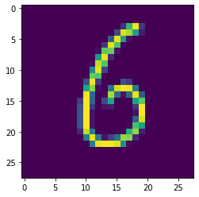
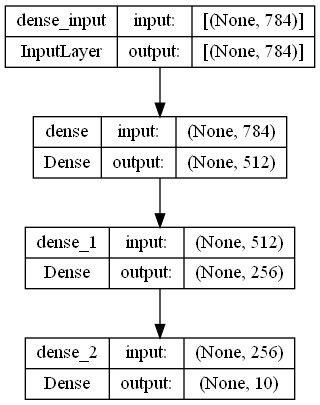

```python
#我的方法~
```


```python
import numpy as np
```


```python
import tensorflow.keras as keras
```


```python
import tensorflow as tf
```


```python
(x1_test,y1_test), (x2_test,y2_test)= keras. datasets.mnist.load_data()#(x1_test=train_image，y1_test=train_label),(x2_test=test_image,y2_test=test_label)
x1_test.shape, y1_test.shape, x2_test.shape, y2_test.shape
```


    ((60000, 28, 28), (60000,), (10000, 28, 28), (10000,))


```python
x= x1_test[18]
for i in range(28):
    for j in range(28):
        z= x[i,j]
        print(f'{z:3d}', end='')
    print()
    
#range(28)代表由28X28矩陣所組成
```

      0  0  0  0  0  0  0  0  0  0  0  0  0  0  0  0  0  0  0  0  0  0  0  0  0  0  0  0
      0  0  0  0  0  0  0  0  0  0  0  0  0  0  0  0  0  0  0  0  0  0  0  0  0  0  0  0
      0  0  0  0  0  0  0  0  0  0  0  0  0  0  0  0  0  0  0  0  0  0  0  0  0  0  0  0
      0  0  0  0  0  0  0  0  0  0  0  0  0  0  0  0 34169250 40  0  0  0  0  0  0  0  0
      0  0  0  0  0  0  0  0  0  0  0  0  0  0  0 58242221143 17  0  0  0  0  0  0  0  0
      0  0  0  0  0  0  0  0  0  0  0  0  0  0 75247143 10  0  0  0  0  0  0  0  0  0  0
      0  0  0  0  0  0  0  0  0  0  0  0  0 37245184  2  0  0  0  0  0  0  0  0  0  0  0
      0  0  0  0  0  0  0  0  0  0  0  0  8192200 14  0  0  0  0  0  0  0  0  0  0  0  0
      0  0  0  0  0  0  0  0  0  0  0  0139247 28  0  0  0  0  0  0  0  0  0  0  0  0  0
      0  0  0  0  0  0  0  0  0  0  0  7231183  0  0  0  0  0  0  0  0  0  0  0  0  0  0
      0  0  0  0  0  0  0  0  0  0  0125243 50  0  0  0  0  0  0  0  0  0  0  0  0  0  0
      0  0  0  0  0  0  0  0  0  0  0195184  0  0  0  0  0  0  0  0  0  0  0  0  0  0  0
      0  0  0  0  0  0  0  0  0  0 61251 41  0  0  0 64 43  0  0  0  0  0  0  0  0  0  0
      0  0  0  0  0  0  0  0  0  0152210  7  0 96237254247107  0  0  0  0  0  0  0  0  0
      0  0  0  0  0  0  0  0  0  0250 84  0  6223 84 13 87246 72  0  0  0  0  0  0  0  0
      0  0  0  0  0  0  0  0  0 43254 80  0 56151  0  0  0147193  0  0  0  0  0  0  0  0
      0  0  0  0  0  0  0  0  0 67254 41  0 13 19  0  0  0 42253  0  0  0  0  0  0  0  0
      0  0  0  0  0  0  0  0  0 67254 13  0  0  0  0  0  0 14253  0  0  0  0  0  0  0  0
      0  0  0  0  0  0  0  0  0 68255 13  0  0  0  0  0  0 77240  0  0  0  0  0  0  0  0
      0  0  0  0  0  0  0  0  0 67254 13  0  0  0  0  0  5181147  0  0  0  0  0  0  0  0
      0  0  0  0  0  0  0  0  0 25229105  0  0  0  0  5156213 20  0  0  0  0  0  0  0  0
      0  0  0  0  0  0  0  0  0  0107246105 14 49 95217209 27  0  0  0  0  0  0  0  0  0
      0  0  0  0  0  0  0  0  0  0  0107246253253240130  6  0  0  0  0  0  0  0  0  0  0
      0  0  0  0  0  0  0  0  0  0  0  0  0  0  0  0  0  0  0  0  0  0  0  0  0  0  0  0
      0  0  0  0  0  0  0  0  0  0  0  0  0  0  0  0  0  0  0  0  0  0  0  0  0  0  0  0
      0  0  0  0  0  0  0  0  0  0  0  0  0  0  0  0  0  0  0  0  0  0  0  0  0  0  0  0
      0  0  0  0  0  0  0  0  0  0  0  0  0  0  0  0  0  0  0  0  0  0  0  0  0  0  0  0
      0  0  0  0  0  0  0  0  0  0  0  0  0  0  0  0  0  0  0  0  0  0  0  0  0  0  0  0
    


```python
import matplotlib.pyplot as pl

pl.imshow(x)

```


    <matplotlib.image.AxesImage at 0x1f6e8a57df0>


    

    


```python
from tensorflow.keras import models
from tensorflow.keras import layers

network = models.Sequential()
network.add(layers.Dense(512,activation="relu",input_shape=(28*28,)))
network.add(layers.Dense(256,activation="relu",input_shape=(28*28,)))
network.add(layers.Dense(10,activation='softmax'))
```


```python
network.compile(
    optimizer = 'Nadam', # 指定優化器→控制梯度下降的確切規則
    loss = 'categorical_crossentropy', # 指定損失函數
    metrics = ['accuracy'] # 指定評量準則
)
```


```python
x1_test = x1_test.reshape((60000,28*28))
x1_test = x1_test.astype('float32')/ 255

x2_test = x2_test.reshape((10000,28*28))
x2_test = x2_test.astype('float32')/ 255
```


```python
#建模

```


```python
from tensorflow.keras.utils import to_categorical

y1_test = to_categorical(y1_test)
y2_test = to_categorical(y2_test)
```


```python
network.fit(x1_test,y1_test,epochs=16,batch_size=128,validation_split=0.2)
```

    Epoch 1/16
    375/375 [==============================] - 4s 8ms/step - loss: 0.2543 - accuracy: 0.9269 - val_loss: 0.1216 - val_accuracy: 0.9622
    Epoch 2/16
    375/375 [==============================] - 3s 8ms/step - loss: 0.0881 - accuracy: 0.9735 - val_loss: 0.0979 - val_accuracy: 0.9711
    Epoch 3/16
    375/375 [==============================] - 3s 8ms/step - loss: 0.0526 - accuracy: 0.9841 - val_loss: 0.0876 - val_accuracy: 0.9738
    Epoch 4/16
    375/375 [==============================] - 3s 8ms/step - loss: 0.0362 - accuracy: 0.9886 - val_loss: 0.0862 - val_accuracy: 0.9752
    Epoch 5/16
    375/375 [==============================] - 3s 8ms/step - loss: 0.0236 - accuracy: 0.9924 - val_loss: 0.1024 - val_accuracy: 0.9734
    Epoch 6/16
    375/375 [==============================] - 3s 8ms/step - loss: 0.0188 - accuracy: 0.9941 - val_loss: 0.0905 - val_accuracy: 0.9766
    Epoch 7/16
    375/375 [==============================] - 3s 8ms/step - loss: 0.0140 - accuracy: 0.9955 - val_loss: 0.0900 - val_accuracy: 0.9775
    Epoch 8/16
    375/375 [==============================] - 3s 8ms/step - loss: 0.0128 - accuracy: 0.9955 - val_loss: 0.1041 - val_accuracy: 0.9752
    Epoch 9/16
    375/375 [==============================] - 3s 8ms/step - loss: 0.0144 - accuracy: 0.9950 - val_loss: 0.0965 - val_accuracy: 0.9802
    Epoch 10/16
    375/375 [==============================] - 3s 8ms/step - loss: 0.0102 - accuracy: 0.9965 - val_loss: 0.1030 - val_accuracy: 0.9784
    Epoch 11/16
    375/375 [==============================] - 3s 8ms/step - loss: 0.0139 - accuracy: 0.9952 - val_loss: 0.1165 - val_accuracy: 0.9754
    Epoch 12/16
    375/375 [==============================] - 3s 8ms/step - loss: 0.0102 - accuracy: 0.9965 - val_loss: 0.1273 - val_accuracy: 0.9737
    Epoch 13/16
    375/375 [==============================] - 3s 8ms/step - loss: 0.0091 - accuracy: 0.9969 - val_loss: 0.1059 - val_accuracy: 0.9785
    Epoch 14/16
    375/375 [==============================] - 3s 8ms/step - loss: 0.0070 - accuracy: 0.9977 - val_loss: 0.1127 - val_accuracy: 0.9765
    Epoch 15/16
    375/375 [==============================] - 3s 8ms/step - loss: 0.0070 - accuracy: 0.9975 - val_loss: 0.1206 - val_accuracy: 0.9768
    Epoch 16/16
    375/375 [==============================] - 3s 8ms/step - loss: 0.0080 - accuracy: 0.9973 - val_loss: 0.1132 - val_accuracy: 0.9776
    


    <keras.callbacks.History at 0x1f6e7ae3880>


```python
from tensorflow.keras.utils import plot_model
network.summary()

plot_model(network, 
    show_shapes= True,
)
```

    Model: "sequential"
    _________________________________________________________________
     Layer (type)                Output Shape              Param #   
    =================================================================
     dense (Dense)               (None, 512)               401920    
                                                                     
     dense_1 (Dense)             (None, 256)               131328    
                                                                     
     dense_2 (Dense)             (None, 10)                2570      
                                                                     
    =================================================================
    Total params: 535,818
    Trainable params: 535,818
    Non-trainable params: 0
    _________________________________________________________________
    


    

    


```python
test_loss , test_acc = network.evaluate(x2_test,y2_test)

print('test_acc:',test_acc)

```

    313/313 [==============================] - 1s 2ms/step - loss: 0.1055 - accuracy: 0.9794
    test_acc: 0.9793999791145325
    


```python

```


```python

```
